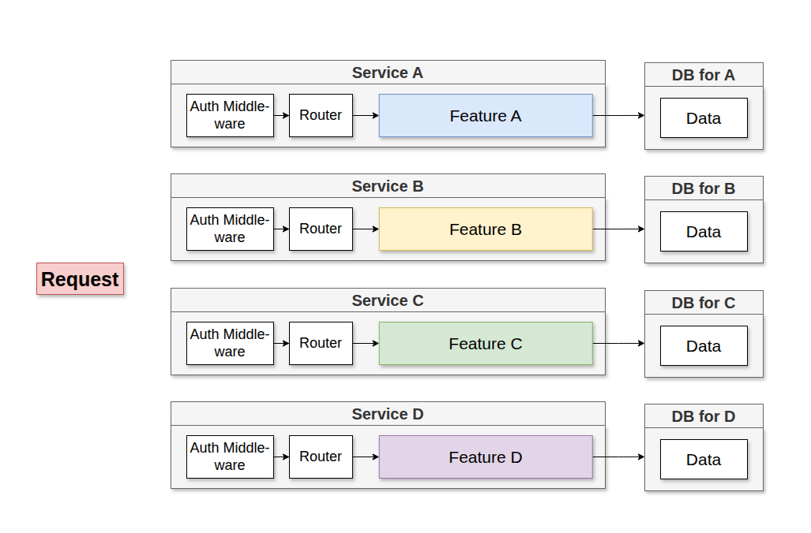
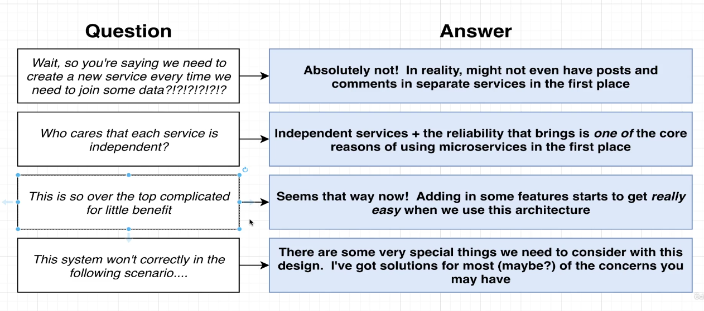

In Monolith, it contains all **Routing**, **Middlewares**, **Business Logic** and **Database Acces** to implement **all featurs** of our app.

In A Microservice, contains all **Routing**, **Middlewares**, **Business Logic** and **Database Acces** to implement **one feature** of our app.

All these Service in Microservice is **self contained**. Each service is standalone. Means even if all the services crash the portion of it will still run.

## What's the big challege in microservice
- Data Mangement between service 

### With microservice, we store and access data in sort of **strange way**
- Each server get its own database( if it needs one )
- Service will never, ever reach into **another services database**

### Why Database-Per-Service
- We want each service to run independently of other services
- Database schema/structure might change unexpectedly
- Some services might function more effeciently with different types of DB's (sql vs nosql)

## Communication strategies between services
- **Sync** : Services communicates with each other using direct requests
- **Async** : Services communicates with each other using events ( There are 2 possibiliteis of Async comunication using EventBus)

### Notes on Sync Communication
Up
- Conceptually easy to understand
- May not need a database. If doesnt required

Down
- Introduces a dependecy between services
- If any inter-service request fails, the overall request fails
- The entire request is only as fast as the slowest request
- Can easily introduce webs of requests

### Notes on Async Communication
Up 
- Creating a db for non db required service, makes it zero dependent on other services
- It will be very fast

Down
- It will ahve data duplication
- And Harder to understand

### Common Questions around Async Communication

## Event Bus

- Many different implementation, RabbitMQ, Kafka, NATS
- Recieves events, publishes them to listeners
- Many different subtle features that make async communication way easier or way harder

### How to define boundaries between microservice
- Each Bounded context represents a specific domain or subdomain within the business that contains its own ubiquitous language, domain model and set of buisness rules.
